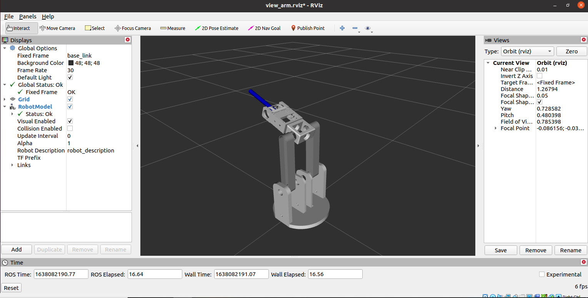

# Arm URDF Package

Author: Jonathan Qiao

Email: jonathanqfxw@gmail.com

# Descripton:

**This package is meant to be an envorment to develope the URDF of the arm.**

The vast majority of the URDF is defined in **arm_urdf/urdf/arm_urdf.xacro**. The xacro file contains a xacro macro with name **arm** and parameter **prefix (string)**, prefix will be used to defined unique arm. This file acts like a function definition but for URDF

The xacro file with path **arm_urdf/urdf/main.xacro** is where the URDF is explicitly called and connected to the world.

# Usage:

## Example: define a new arm with prefix arm1 and attach it to world origin
```xml

<!-- world origin is just a designated link that is set as "fixed frame" in rviz. 

World origin link is named "base_link" in this case -->
<link name="base_link"/>

<!-- use xacro to define arm with prefix "arm1" -->
<xacro:arm prefix="arm1"/>

<!-- attach arm1 to world origin  -->
<joint name="base" type="fixed">
    <parent link="base_link" />
    <child link="arm1_base" />
</joint>
```

## View the model in rviz:

*rviz: a renderer that comes installed with ros*

***Execute following command in termial:***

```bash
# only need to be sourced once for every new terminal session
source <path to workspace>/devel/setup.bash

roslaunch arm_urdf arm_urdf.launch
```

**Preview Image**

