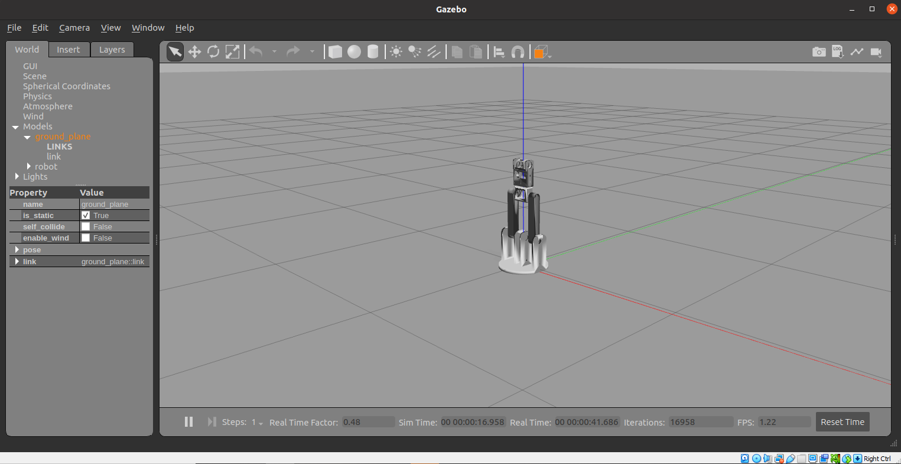
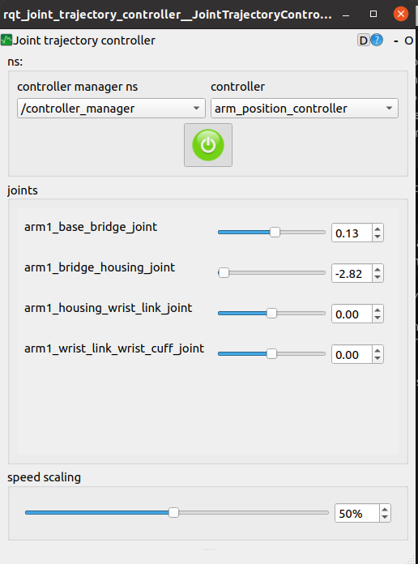

# MoveIt Config Package

Author: Jonathan Qiao

Email: jonathanqfxw@gmail.com

# Descripton:

**This package is meant to be an envorment to simulate the arm in Gazebo**

Vast majority of the config files in configs and launch folders are generated by MoveIt Setup Assistant (MSA). ***TRY TO EDIT THE FILES IN CONFIG AND LAUNCH FOLDERS AS LITTLE AS POSSIBLE.*** The reason being that once the file is edited manually, MSA will not try to change it after reconfiguring with MSA. Try to use MSA to change configurations as much as possible, for it is much more robust and coprehensive.

# Usage

## Fast demo with Rviz

If you just want a quick look at the package working you can use a demo prepared by Moveit.

To run the demo run the following command in terminal.
```bash
source <path to workspace>/arm/devel/setup.bash
roslaunch moveit_config demo.launch
```

## Using MoveIt Setup Assistant (MSA) in this package context

1. Make sure MoveIt is installed. To install MoveIt run the following command in terminal

```bash
sudo apt install ros-noetic-moveit
```

2. Open a terminal and enter the following commands (No sourcing nessesary).

```bash
roslaunch moveit_setup_assistant setup_assistant.launch
```

Then it should open this:


3. Choose "Edit Existing MoveIt Configuration Package" and navigate to the folder *../arm/moveit_config/*

4. Now edit the config as you please


**For more on how to use MSA check out MoveIt's guide:**

[MoveIt Guide](https://ros-planning.github.io/moveit_tutorials/doc/setup_assistant/setup_assistant_tutorial.html)


## Launch Simulation in Gazebo

1. Make sure Gazebo is installed. To install Gazebo follow this [tutorial](https://gazebosim.org/tutorials?tut=ros_installing&cat=connect_ros)

2. Make sure the ros controller packages is installed. To install the packages run the following command.

```bash
sudo apt-get install ros-noetic-ros-control ros-noetic-ros-controllers
```

3. To launch the Gazebo simulation with this package, use the following command

```bash
source <path to workspace>/arm/devel/setup.bash

roslaunch moveit_config gazebo.launch
```

You should see the following showing up:




4. (OPTIONAL) The previous steps will only open up Gazebo with the arm loaded. In order to control the joints you need to interact with the joint_state_controller. To do this, the easiest way is to use the rqt_joint_trajectory_controller, a GUI controller. To do this first make sure the GUI controller is installed with the following command.

```bash
sudo apt install ros-noetic-rqt-joint-trajectory-controller
```
5. (OPTIONAL) Use the following command in another terminal after step 2 is running in the first terminal to open the GUI.

```bash
source <path to workspace>/arm/devel/setup.bash

rosrun rqt_joint_trajectory_controller rqt_joint_trajectory_controller
```

After everything runs smoothly you should see this:



## Launch Enviorment in Gazebo / RVIZ

Difference in launching Gazebo/Rviz as enviorment is that the launch file includes launching ```move_gorup.launch``` generated by MSA. Which is mandatory for Inverse Kinematics and path planning. Therefore, when controlling the arm it is a must.

To launch the enviorment use the following commands
```bash
source <path to workspace>/arm/devel/setup.bash

roslaunch moveit_config enviorment.launch use_gazebo:=true 
```

The ```use_gazebo``` parameter tells it to launch Gazebo when true or Rviz when false for simulator. 


# Fixed Errors Notes:
**Past errors encountered and fixed, noted for future encounters with the same error** 

---
```[ERROR] [1643169838.177174081, 27.333000000]: Robot semantic description not found. Did you forget to define or remap '/robot_description_semantic'?```

Error found when trying to run moveit_commander in node/python

According to [this answer](https://answers.ros.org/question/258298/robot-semantic-description-not-found/) the issue resides with ``move_config/launch/move_group.launch`` not running.

---
```Resource not found: moveit_resources_prbt_moveit_config```

Error found when trying to run ``moveit_config/launch/move_group.launch``, the same error also occures when trying to run ``demo.launch`` as it runs ``move_group.launch``

The reason why it cannot find ``moveit_resources_prbt_moveit_config`` seems to be because it was named supposed to be named after the package name. In this case it was fixed by changing line 61 of ``move_group.launch``

From:
```xml
    <!-- Pilz Industrial Motion-->
    <include ns="pilz_industrial_motion_planner" file="$(find moveit_resources_prbt_moveit_config)/launch/planning_pipeline.launch.xml">
      <arg name="pipeline" value="pilz_industrial_motion_planner" />
    </include>
```

To:
```xml
    <!-- Pilz Industrial Motion-->
    <include ns="pilz_industrial_motion_planner" file="$(find moveit_config)/launch/planning_pipeline.launch.xml">
      <arg name="pipeline" value="pilz_industrial_motion_planner" />
    </include>
```

---
```RLException: unused args [execution_type] for include of [/home/jonathan/Development/PythonProjects/arm/src/moveit_config/launch/robot_moveit_controller_manager.launch.xml]```

Error found when trying to run ``moveit_config/launch/move_group.launch``, the same error also occures when trying to run ``demo.launch`` as it runs ``move_group.launch``

The problem according to [this answer](https://answers.ros.org/question/378891/cannot-connect-moveit-with-gazebo/) seems to be that there exists an extra line in ``src/moveit_config/launch/trajectory_execution.launch.xml`` line 21. It was fixed by commenting it out.

---
```[ERROR] [1643188290.618355939]: Exception while loading planner 'pilz_industrial_motion_planner::CommandPlanner': Failed to load library /opt/ros/noetic/lib//libpilz_industrial_motion_planner.so. Make sure that you are calling the PLUGINLIB_EXPORT_CLASS macro in the library code, and that names are consistent between this macro and your XML. Error string: Could not load library (Poco exception = libmoveit_planning_interface.so.1.1.7: cannot open shared object file: No such file or directory)```

A similar but slighly different error message will also appear when you are missing ``pilz_industrial_motion_planner`` library. Read the error fix documentation below this one to see more.

Error found when trying to run ``moveit_config/launch/move_group.launch``, the same error also occures when trying to run ``demo.launch`` as it runs ``move_group.launch``.

Similar problem was seen in [this answer](https://answers.ros.org/question/194341/rviz-motion_planning-error-failed-to-load-library/). 

The solution used here was to simply update by running these commands:
```bash
sudo apt-get update
sudo apt-get dist-upgrade
```

---
```[ERROR] [1643186732.919811417]: Exception while loading planner 'pilz_industrial_motion_planner::CommandPlanner': According to the loaded plugin descriptions the class pilz_industrial_motion_planner::CommandPlanner with base class type planning_interface::PlannerManager does not exist. Declared types are  chomp_interface/CHOMPPlanner ompl_interface/OMPLPlanner```

Error found when trying to run ``moveit_config/launch/move_group.launch``, the same error also occures when trying to run ``demo.launch`` as it runs ``move_group.launch``.

The problem seems to be that moveit is missing ``pilz_industrial_motion_planner`` library. This was solved by installing the library with the following command:
```bash
sudo apt-get install ros-noetic-pilz-industrial-motion-planner
```


